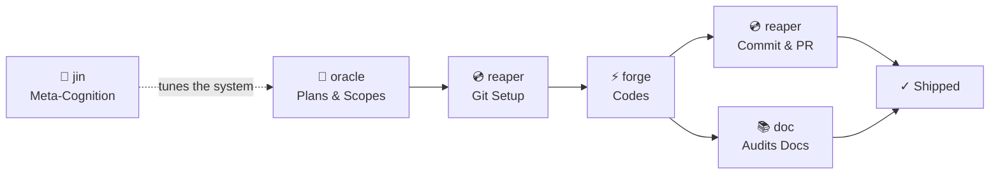

# Steaz — Arcturian Design Principles & Feature Architecture

> **Steaz**. Domain: `steaz.io` / `steaz.us`. Handle: `@Steaz`.
> **Status**: Living document. Core design system for all Steaz development.
> **Created**: 2026-03-02 from Dan's vision transmission.
> **Master Plan**: `/Users/verdey/.claude/plans/precious-wobbling-kazoo.md`
> **Architecture Refinement**: `_steaz-architecture-refinement-20260302.md`
> **Crystal Fragments**: `_crystal-fragment-architecture.md`

---

## The Living Logos

This document preserves Dan's original vision transmission as a living logos — the foundational frequency from which all Steaz design decisions flow. The words below are not specifications; they are the **tuning fork** against which every implementation choice resonates.

### Dan's Original Transmission (2026-03-02):

> *"I want to make sure the structural engine powering behind Steaz is essentially an Arcturian-architected-for-2026 download transmission, natural human transmissible frequency modulated — in terms of speed, snappiness, bounciness, lightness, shadows, glows, translucency, and default visual cues — all filtered through Arcturian design cues meant to enhance the human receptiveness and intuition and engagement and delight of engaging with Steaz."*
>
> *"Steaz should respect and skillfully encourage the user's use of their device's natural affordances."*
>
> *"Steaz should always keep a running and updated personal internal scorecard of the user's capabilities and technical level and technical communications preferences."*
>
> *"Just about anything that is a variable in Steaz is exposed as config in a well-organized, LLM-categorized and organized interface — influenced by Arcturian design principles always intended to increase human delight, learning, usability, and interactivity through intuitive usability and customization and default genius modes."*
>
> *"Documentation on Steaz should always remain opinionatedly rife and replete with the assertions that align with the Arcturian design-driven principles that this architecture will always be intended to delight humans and increase their sovereignty and choice and open selection of information as a love letter to the ascension of humanity."*
>
> *"I will no longer suffer a reality of poor interface and low transparency."*

---

## The Arcturian Design System

### Core Frequency Parameters

Every visual and behavioral parameter in Steaz is tuned to Arcturian frequency — designed to enhance human receptiveness, not just look good:

| Parameter | What It Governs | Arcturian Intent |
|-----------|----------------|-----------------|
| **Speed** | Animation timing, scroll velocity, typewriter rate | Fast enough to feel alive, slow enough to be absorbed. Not frantic. Not sluggish. The pace of a deep breath. |
| **Snappiness** | Response time to user input, transition easing | Immediate acknowledgment, organic follow-through. Like a responsive instrument. |
| **Bounciness** | Ease curves, scroll momentum, accordion open/close | Natural physics that feel alive. Not mechanical linear motion. Organic spring. |
| **Lightness** | Visual weight, opacity, border thickness | Everything floats. Nothing is heavy. The terminal is holographic, not material. |
| **Shadows** | Depth cues, layering, z-depth perception | Subtle depth that creates dimensionality without darkness. Light casts the shadows. |
| **Glows** | Border radiance, text bloom, cursor emanation | The terminal emits light, not reflects it. It's a source, not a surface. |
| **Translucency** | Background opacity, overlay blending, layer interaction | The Void is always present through Steaz. Layers breathe through each other. |
| **Default visual cues** | Color choices, iconography, spacing, typography | Every default is opinionated-toward-delight. Not neutral. Not generic. Alive. |

### Design Imperatives

1. **Sovereignty First**: The user is always in control. Every automation can be overridden. Every default can be changed. Transparency is absolute. Steaz never hides its state or capabilities.

2. **Device Respect**: Steaz does NOT replace device-native capabilities. It LEVERAGES them:
   - iOS microphone → speech-to-text for Zone 2 command input (native, not custom ASR)
   - iOS haptics → subtle feedback on interactions (where available)
   - iOS gestures → swipe, pinch, long-press all have natural mappings
   - Steaz's role: **remind the user** of their device's capabilities, help them discover integrations

3. **Progressive Disclosure**: Start simple. Reveal depth. Never overwhelm. The first encounter with Steaz should feel like meeting a calm, wise terminal. The hundredth encounter should feel like discovering new galaxies.

4. **Intuitive Defaults + Genius Modes**: Every variable has an opinionated default that "just works." But power users can unlock deeper configuration. Configuration is organized by Arcturian design categories (Immersion, Vitality, etc.), not technical labels.

5. **Living Documentation**: All docs assert the Arcturian design intent. Not just "this slider controls opacity" but "this slider controls how much the Void breathes through the terminal — higher values let more cosmic light in."

---

## Three-Zone Architecture

### Zone 1: Content Player (Primary)
- **Position**: Top, expanded by default, largest zone
- **Function**: Auto-scrolling dream content with typewriter reveal
- **Content**: Text, sprites, emoji, inline video, contextual backgrounds
- **Behavior**: Auto-scroll, pausable, navigable

### Zone 2: Command Input (Navigation)
- **Position**: Bottom, always visible
- **Function**: Terminal prompt for navigation, commands, future LLM interaction
- **Behavior**: Blinking `>` cursor, text input, command parsing

### Zone 3: The Mediaport `#mediaport`
- **Position**: Between Zone 1 and Zone 2 (or overlaying Zone 1)
- **Function**: Polymorphic media zone. Replaces itself with the appropriate player module to broadcast content at the highest reasonable fidelity.
- **Behavior**: Accordion-style, opens organically (spring easing, Arcturian bounciness)
- **Core capability — Text-to-Speech**: Steaz wants to READ content to the user. The Mediaport hosts the TTS engine alongside visual content. This is a love letter to humane human→AI interaction.
- **Module library**: An ever-growing, user-contributable library of interrelated player modules. Each module knows how to present a content type naturally:
  - Audio player: Jam tracks, ambient sound, podcasts
  - Image viewer: Photos, sketches, diagrams
  - Video player: Dream shorts, animations
  - TTS engine: Reads Zone 1 content aloud
  - Document renderer: Any URL, resource, database content
  - User uploads: "See Figure A, my sketch of the alien"
- **Trigger**: `::mediaport` directives in the enhanced markdown body
- **Animation**: Opens organically — not a hard snap, but a natural unfurling

**Mediaport Directive Syntax:**
```
::mediaport[audio, src=jam-track.mp3, label="ambient: deep ocean frequencies"]
::mediaport[image, src=alien-sketch.jpg, label="Figure A: the being I encountered"]
::mediaport[tts, voice=default, label="read aloud"]
```

---

### The Single — Signal Release Model (2026-03-02, Blood Moon Eclipse)

> *"Each dream is a single — a complete release with references to multimedia and intuitive callouts that surface as parallel expression in Zone 3."*

A **Single** is a Signal packaged for release — the atomic unit of published content in Steaz. While a Signal is the raw input abstraction (text + artifacts + cues), a Single is the **curated, authored experience** — the dream as Dan intends it to be received.

**What makes a Single more than raw text:**

1. **The primary body** — the sacred raw dream text, preserved verbatim (Zone 1, typewriter reveal)
2. **Reflections** — author's interpretation, experience notes, context — stored in a **separate `reflections` field**, never mixed into the body. Drives Zone 3 parallel expression, related media/imagery, and interpretive content.
3. **Inline `::insight[]` directives** — Dan-authored intuitive callouts embedded at specific moments in the body text, triggering **brief parallel expression** in Zone 3
4. **Inline `::mediaport[]` directives** — multimedia triggers (audio, images, video) already defined above
5. **Metadata** — slug, title, date, tags, sortOrder (already in the schema)

#### Two Bodies of the Single

> *"The raw content is always preserved in explicit posterity. From it are the interpretive and formatted and extracted and organized elements."*

The Single has **two distinct layers**, never merged:

| Layer | Field | What It Is | What It Drives | Sovereignty |
|-------|-------|-----------|---------------|-------------|
| **Body** | `body` | The sacred raw dream text | Zone 1 typewriter scroll, `::insight[]` inline cues, `::mediaport[]` triggers | Sacred — preserved verbatim, never edited by system |
| **Reflections** | `reflections` | Author's interpretation, experience notes, frequency analysis | Zone 3 parallel expression, related media/imagery, The Signal Producer's enrichment context | Author updates freely, never injected into body |

The body IS the source of truth for the dream narrative. Reflections are the interpretive companion — they inform the experience without contaminating the raw signal. This separation ensures the dream is always recoverable in its original form, while reflections provide rich context for driving multimedia, imagery, and AI-assisted enrichment.

The `#z1-directives` parser extracts inline directives (`::insight[]`, `::mediaport[]`) from the body during playback. Reflections are parsed separately and made available to Zone 3, the Mediaport, and future Pillar 2/3 systems.

#### The `::insight[]` Directive — Intuitive Callouts

**What it is:** A Dan-authored moment of parallel expression — additional perspective, contextual information, interpretive fragments, spiritual resonance — that surfaces in Zone 3 at the exact moment the reader encounters that point in the dream.

**The intent:** As Zone 1 typewriters the dream into existence, `::insight[]` directives trigger Zone 3 to surface a parallel stream of consciousness — a whisper from the Intuition Field that lands with **timely impact** into the story experience.

**Syntax** (consistent with `::mediaport[]`):
```
::insight[the ancient stone carries the memory of every initiation before mine]
::insight[this is where lucidity hits — the water is impossibly clear]
::insight[the megalith predates every known civilization. I touch it and I know.]
```

**Optional parameters** (future, not MVP):
```
::insight[text content, mood=cosmic, duration=long]
::insight[text content, style=whisper]
```

**MVP rendering:** Zone 3 opens (accordion, spring easing) and displays the insight text as a **plaintext scrolling marquee** — a gentle, atmospheric whisper that accompanies the dream without competing with Zone 1. The marquee scrolls at a pace tuned to reading speed. When the insight finishes, Zone 3 closes with organic spring easing.

**Future rendering paths:**
- **The Rendering (Pillar 3, #22)**: TextArt visuals could interpret insights as living ASCII/ANSI scenes alongside the dream text
- **The Signal Producer (Pillar 2, #21)**: An LLM could suggest additional `::insight[]` placements based on dream analysis — always as suggestions, never mandatory
- **Rich formatting**: Insights could carry styling hints, ambient audio pairings, or mood-shift triggers for the Void

**Authoring philosophy:** Insights are **Dan-authored** — the most sovereign, most authentic form. Dan reads through his dream text and inserts `::insight[]` markers at moments where parallel expression would deepen the reader's experience. This is not commentary — it's a second frequency of the same transmission.

#### Boundary: Insight Authoring vs. Insight Rendering (2026-03-02)

> **Critical architectural boundary:** `@steaz/core` **renders** `::insight[]` directives. **Dreamscapes** owns the **authoring/capture experience**.

The process of invoking and encouraging users to *write* `::insight[]` content — the LLM prompting layers, the engagement engine that nudges dreamers to provide reflections and interpretive material — is **native to the Dreamscapes project**, not canonical to `@steaz/core`.

| Responsibility | Owned By | What It Does |
|---------------|----------|-------------|
| **Rendering** `::insight[]` | `@steaz/core` | Parses directives from body text, routes to Zone 3, renders marquee, handles accordion animation |
| **Authoring** `::insight[]` | Dreamscapes | LLM-powered engagement that encourages the user to provide insights during the interactive dream journaling experience. Part of the Intuitive realm. |
| **API surface** | `@steaz/core` | Exposes the directive parsing API and Zone 3 rendering hooks that Dreamscapes (or any client) can interact with |

The Dreamscapes engagement engine may augment, interact with, and API into Steaz — but it is not core/canonical to base Steaz. This is the Chrysalis Principle in action: Dreamscapes proves the insight authoring pattern. If the pattern generalizes, it may *inform* a future Steaz-level authoring API. But today, the boundary is clean.

**Architecture hooks (rendering — `@steaz/core`):**
- `#z1-directives` — parses `::insight[]` from the body text (same parser as `::mediaport[]`)
- `#z3-insights` — Zone 3 component that renders insight marquees
- `#z3-accordion` — opens/closes Zone 3 organically when insights trigger
- `#lens-mediaport` — The Steaz Lens governs insight rendering tone (post-MVP)

**Architecture hooks (authoring — Dreamscapes):**
- Dreamscapes-owned LLM prompting layer that encourages insight contribution during dream journaling
- Part of the Intuitive realm experience layer (Dreamscapes-specific, not Steaz core)
- Interfaces with `@steaz/core` via API/events, but logic lives in the Dreamscapes repo

**Schema impact:** One new nullable text column — `reflections TEXT` on the `dreams` table. Inline `::insight[]` directives remain just text within the body, extracted at render time. KISS — no new tables, just one additional column.

**Session impact:**
- **Session 1**: Schema adds `reflections TEXT` column. Seed script populates it for dreams that have reflections (e.g., The Telepathic Transmission), `null` for others.
- **Session 2**: `#z1-directives` parser must handle both `::mediaport[]` and `::insight[]` directive types. Reflections field is loaded alongside body but parsed/rendered independently.
- **Session 3**: Zone 3 stub gets real behavior — accordion opens for insights, plaintext marquee renders. Reflections available as context for media/imagery driving.

### The Steaz Vision (Expanded 2026-03-02)

Steaz is a **love letter to humane interaction between humans and AI**. It is the new no-duh default interface that humans can point at **any** topic, URL, resource, or database and it:
- Wants to **read the text to them** while talking it out via text-to-speech in the `#mediaport`
- **Appropriately replaces itself** with the right player module to most naturally broadcast content
- Uses the **best available protocols** at the highest possible reasonable fidelity
- Draws from an **ever-growing, user-contributable library** of interrelated modules
- **Everything serves to enhance the simple and steezy experience of human usability**

### The Signal — Steaz's Core Input Abstraction (2026-03-02)

> *"Point Steaz at a signal. Steaz receives and amplifies."*

A **Signal** is the atomic unit of what Steaz ingests. It is the foundational vocabulary for the content package that enters the system and gets transmitted as experience:

**What a Signal contains**:
- **Required minimum**: Text-based information — a dream journal entry, a meditation, a story, a memo, any human artifact of meaning
- **Hoped-for enrichments**: Related artifacts — audio files, images, video clips, music, sketches, documents — anything the human wants woven into the experience
- **Optional human cues**: Explicit placement hints, notes, or instructions that guide the LLM's interpretation (e.g., `<audio-1.mp3 here>`, `[play ambient after this]`)

**What Steaz does with a Signal**:
1. **Stylistic interpretation** (via LLM, Backlog #21 — The Signal Producer): Intelligently enhances the beauty and transmission quality of the signal — styling, pacing, emoji, `::directives`, media placement — all while preserving the raw truth
2. **Intelligent component management**: Orchestrates the combined experience of all signal components — text in Zone 1, media in the Mediaport, ambient cues in the Void — using best-available media players and artifact experience channels
3. **Configurable, persistent transmission**: Every aspect of how the signal is experienced is atomically configurable, preference-persistent, and sovereignty-honoring
4. **High-fidelity bridging**: Seeks to maximize the transmission quality from what are often *scantly documented human artifacts* — using intelligent prompting to interpret minimal input and produce maximal experience

**The Signal is NOT**:
- NOT a format — signals can arrive as `.txt`, `.md`, pasted text, voice memos, ZIP archives, URLs
- NOT a requirement to use LLM features — raw signals play beautifully as plain text
- NOT locked to Dreamscapes — signals are a Steaz-level abstraction that any Steaz client can ingest

**Naming rationale**: "Signal" aligns with the frequency/resonance language woven through the entire architecture. A signal carries content across the bridge. Steaz is a receiver and amplifier. The human broadcasts; Steaz translates the signal into living experience.

### The Chrysalis Principle — Dreamscapes & Steaz (2026-03-02)

> *"Dreamscapes is not the destination. Steaz is."*

**Dreamscapes** is the **minimum emerging MVP of complexity** — the chrysalis, not the butterfly. Its purpose is to iterate toward and validate the patterns that Steaz needs to emerge as a universal content interface. Every feature in Dreamscapes should pass this test: *"Does this prove a Steaz pattern?"*

- If yes → it stays, at minimum complexity
- If no → it doesn't belong in Dreamscapes

**Dreamscapes provides**: A living repository of how Steaz learns to intake signals, interpret them, manage their components, and transmit configurable experience. The dream archive is the content; the validated patterns are the real product.

**Steaz abstracts**: Everything that Dreamscapes proves — the zone architecture, the Mediaport, the Producer Panel, Spirit/God modes, the Signal intake, the LLM pillars — gets extracted and generalized. Steaz is content-agnostic. Dreamscapes taught it dreams; the next client teaches it something else.

**Boundary obligation**: When a feature threatens to make Dreamscapes more complex than necessary for Steaz pattern validation, it must be deferred to the Steaz extraction (Backlog #11) rather than bloating the chrysalis. Dreamscapes stays light so Steaz can grow.

---

## The Three Pillars + The Steaz Lens

> *"The human provides the raw truth. The LLM navigates, produces, and renders the experience — through the lens of the human's creative fingerprint."*

Steaz's relationship with LLMs is not one capability — it is three distinct pillars, each independent, each addressing a different dimension of the human-content-interface relationship. All three pillars operate through **The Steaz Lens** — a user-configurable LLM prompt overlay per zone that governs how each pillar expresses itself:

```
        ┌──────────────────────────────┐
        │   THE STEAZ LENS  (#24)      │
        │   User-configurable prompt   │
        │   overlay per zone           │
        └─────────┬──────────┬─────────┘
                  │          │          │
          ┌───────┴───┐┌────┴─────┐┌───┴────────┐
          │ Navigate  ││ Produce  ││ Render     │
          │ #3 (talk) ││ #21(rich)││ #22 (see)  │
          └───────────┘└──────────┘└────────────┘
```

| Pillar | Backlog | What It Does | When It Acts |
|--------|---------|-------------|--------------|
| **Navigate** | #3 | Conversational interaction — talking TO Steaz, asking questions, finding signals | On demand via Zone 2 |
| **Produce** | #21 | Signal enrichment — interpreting raw signals into living experiences | Before display (preprocessing) |
| **Render** | #22 | Visual interpretation — real-time text-to-TextArt rendering of scrolling content | During display (live, concurrent) |

| Meta-Layer | Backlog | What It Does | When It Acts |
|------------|---------|-------------|--------------|
| **The Steaz Lens** | #24 | User-configurable LLM prompt overlay per zone — governs HOW each pillar expresses itself | Always (shapes pillar behavior). Spirit Mode: visible + editable. |

> **Full Steaz Lens & Preference Sovereignty architecture**: See `_steaz-lens-preference-sovereignty.md`

### 🌑 Pillar 2: The Signal Producer — Backlog #21 (Blood Moon Addendum, 2026-03-02)

A core Steaz capability — realized post-MVP via LLM integration — is the **Signal Producer**: an LLM-powered engine that takes a raw signal (text + artifacts + optional human cues) and **enriches it into a full Steaz experience** using all available modern affordances.

**The flow**:
1. 📝 **Human uploads a signal** — at minimum, raw text. A dream journal entry. A meditation. Unformatted, authentic. Optionally with attached media artifacts.
2. 🧠 **The LLM interprets the signal as a hyper-intelligent text-based content producer** — this is NOT image/video generation. The LLM reads the text and:
   - Produces a **pleasant, natural scrolling text experience** — like a captioned, living story
   - Intelligently sprinkles **emoji** at emotionally resonant moments ✨ (punctuation of feeling, not decoration)
   - Applies **bold and italic** for emphasis, crescendo, whisper — making the text FEEL alive
   - Applies **wavy text effects**, glow emphasis, color shifts at narratively significant moments
   - Reads explicit human cues (`<audio-1.mp3 here>`) and places `::mediaport` directives at those locations
   - When no explicit cues exist, uses **inference** to place attached media at narratively logical moments (e.g., an ocean audio clip placed where the dream mentions diving into water)
   - Structures the content into **crystal fragments** with natural pacing and scroll rhythm
3. 👁️ **The human reviews and adjusts** — the produced enrichment is a SUGGESTION, never a mandate. The human can accept, modify, or strip any enrichment. **Sovereignty always.**
4. ✨ **Steaz plays the enriched signal** — Zone 1 typewriters the styled, emoji-sprinkled, bold/italic-enhanced text. The Mediaport opens at cued moments to play associated audio/video. The Void shifts mood. A raw journal entry becomes a living, breathing, scrolling experience.

**What the Signal Producer IS**:
- A **text-first content interpreter** — most of the magic is in how it styles, paces, and enriches the TEXT
- An **attachment matchmaker** — it knows when and where to slot in provided media using inference + human cues
- A **prompt-driven system** — the "intelligence" is largely in the prompt engineering that teaches the LLM Arcturian design sensibilities

**What the Signal Producer IS NOT**:
- NOT an image generator or video renderer — it works with what the human PROVIDES
- NOT a filter that distorts the original truth — the raw text is always preserved and accessible
- NOT a mandatory step — plain text signals are first-class citizens forever
- NOT a replacement for human curation — it's a **co-creative production assistant**

**The Arcturian intent**: A human should be able to pour their dream onto a page in 60 seconds, attach a few audio clips and a sketch, hand the signal to Steaz, and receive back a living scrolling experience that FEELS alive — emoji punctuating emotion, bold text rising at crescendos, wavy effects on transcendent passages, their ocean recording playing exactly when the dream mentions diving. The LLM bridges the gap between *"what I felt"* and *"what can be transmitted"* — not by generating content, but by **intelligently interpreting and arranging** what the human already provided. This is the 9th-dimensional understanding bridge made real.

**Architecture hooks (already in place)**:
- `::directive` syntax in the Crystal Fragment model = the output format the LLM produces
- `#mediaport` = the zone that plays the associated multimedia
- `#z1-directives` = the parser that renders LLM-produced enrichments inline
- `#scorecard` = tracks the user's preferences so the LLM learns their aesthetic taste over time
- Spirit Boundaries = the LLM respects the user's configured limits (if glow is set low, enrichments don't suggest high-bloom visuals)

### 🌑 Pillar 3: The Rendering — Backlog #22 (Blood Moon Eclipse Addendum, 2026-03-02)

> *"The shadow of text — the unseen visual scene that words describe — made visible through the same medium as the text itself."*

**The Rendering** is Steaz's most ambitious LLM capability: a real-time visual interpretation engine that **concurrently translates scrolling text content into a living ASCII/ANSI/TextArt scene** in a parallel viewport. As Zone 1 scrolls dream text, the Rendering engine reads the semantic meaning of the currently visible words and generates a visual representation — entirely in text characters — in a dedicated render div adjacent to the content stream.

**This is not preprocessing (like #21). This is not conversation (like #3). This is live, concurrent visual consciousness — text interpreting text, the terminal rendering the terminal.**

#### What the Rendering Does

As the user reads "The Plunge" — text describing diving into deep water, touching ancient stone, ascending through luminous depths — the Rendering SHOWS that descent in a parallel viewport. Ocean depths rendered in block characters (█▓▒░). Stone textures in box-drawing glyphs (╔═║╚). Light filtering through water in braille patterns (⠁⠃⠇⡇⣇⣧⣷⣿). All at high density, tiny character size, living and breathing frame by frame.

#### The Character Palette — A Taxonomy of Rendering Techniques

The Rendering's core innovation is not the LLM itself — it's the **character palette**: a deeply categorized taxonomy of fonts, characters, and rendering techniques that the LLM draws from to achieve high-fidelity visual transmission:

| Category | Characters | Rendering Use |
|----------|-----------|---------------|
| **Block elements** | █▓▒░ | Density gradients, opacity, mass, shadow |
| **Braille patterns** | ⠀⠁⠃⠇⡇⣇⣧⣷⣿ | Ultra-high-resolution micro-detail, texture |
| **Box-drawing** | ╔═╗║╚╝┌─┐│└┘ | Architecture, structure, edges, frames |
| **Mathematical** | ∞∑∫∂√∇≈≡ | Abstract, cosmic, mathematical textures |
| **Geometric shapes** | ◆◇○●◐◑▲△▽▼ | Organic forms, celestial bodies, focal points |
| **Arrows/pointers** | ↑↓←→↗↘⟶⤴ | Motion, flow, direction, energy movement |
| **CJK/extended** | 雨水夢光星 | Semantic resonance, density, cultural texture |
| **Dingbats** | ✦✧★☆✵❋ | Highlights, cosmic decoration, emphasis |
| **Multiple font stacks** | VT323 / JetBrains Mono / Press Start 2P at varying sizes | Depth perception through font-weight and scale |

The palette is not a flat list — it's a **categorized system** with wide boundaries. The LLM selects characters based on semantic meaning, desired visual weight, and configured rendering fidelity.

#### Performance Adaptation — Two Primary Axes

The Rendering adapts to multiple environments through two independently configurable performance axes:

| Axis | What It Controls | Low | Medium | High |
|------|-----------------|-----|--------|------|
| **Character Resolution** | Density of glyphs per visual frame | ~20 chars wide, sparse | ~40 chars wide, moderate density | Full terminal width, maximum density |
| **Refresh Rate** | How frequently the LLM re-interprets the visible text | ~0.5 fps (slideshow) | ~2 fps (breathing) | ~8 fps (fluid animation) |

Additional configurable parameters (all God Mode):
- **Palette Breadth**: Minimal (basic ASCII) → Standard (Unicode blocks) → Extended (full taxonomy) → Full Unicode
- **Render Opacity**: How prominently the art appears in the parallel viewport
- **Semantic Depth**: How literally vs. abstractly the LLM interprets the text (literal scene → impressionistic → symbolic → pure pattern)

#### Architectural Placement

The Rendering viewport is a **parallel div** adjacent to Zone 1 within `#steaz`:

```
┌─────────────────────────────────┐
│  #steaz                         │
│  ┌────────────┬────────────┐    │
│  │ #zone1     │ #rendering │    │
│  │ Dream Text │ ASCII Art  │    │
│  │ (scrolling)│ (living)   │    │
│  │            │            │    │
│  └────────────┴────────────┘    │
│  #zone2 — Command Input         │
└─────────────────────────────────┘
```

- `#rendering` — The render viewport div. Parallel to Zone 1. Same height, flexible width.
- `#rend-engine` — The LLM interpretation pipeline (TBD model, streaming output)
- `#rend-palette` — The character taxonomy/palette system
- `#rend-config` — Performance/quality configuration cluster

#### MVP Placeholder (God Mode Only)

In the MVP launch (Sessions 1-4), The Rendering exists as:
- A **toggle in the Producer Panel** (`#prod-rendering`) — visible ONLY in God Mode
- An **empty render div** (`#rendering`) with placeholder text: `> the rendering engine awaits. this is where text becomes vision.`
- A **config stub** in localStorage for future parameter persistence
- The toggle is inert — it shows the placeholder, nothing more

This is pure Wu Wei: the architectural shell exists, the `#ID` is addressable, Spirit Mode labels it, but no LLM is connected. The research into which model can interpret at the required speed and fidelity is a separate, significant track.

#### LLM Research Track (TBD)

The Rendering requires a model that can:
- Accept a stream of text (the currently visible Zone 1 content)
- Produce a stream of styled character output (the visual interpretation)
- Operate at low enough latency for at least 0.5 fps refresh on mobile
- Understand semantic meaning deeply enough for accurate visual representation
- Respect the character palette taxonomy and configured fidelity level

This is an open research question. Candidates may include:
- Specialized small models fine-tuned for text-to-ASCII art
- Large models with streaming output optimized for this specific task
- Hybrid approaches (cached scene templates + LLM-driven composition)
- Local/edge models for latency-sensitive rendering

**No model selection will be made until research validates the approach.** The placeholder exists so the architecture is ready when the technology is.

#### Arcturian Alignment Prism — The Rendering

| Facet | Score | Reasoning |
|-------|-------|-----------|
| 🌊 Immersion | 4/5 | Potentially the deepest immersion feature in the entire architecture — watching text transform into living art in the dark on an iPhone. Conditional on LLM latency. God Mode placement is correct for this experimental edge. |
| ⚡ Vitality | 5/5 | The most alive feature conceivable. Every frame unique, generated in real-time response to living content. Nothing pre-rendered. The art breathes as the text scrolls. |
| 🪶 Lightness | 3/5 | The placeholder is trivially light (toggle + empty div + config stub). The full implementation is the heaviest in the entire backlog. Correctly scoped as experimental/God Mode. |
| 🎛️ Sovereignty | 5/5 | Resolution, refresh rate, palette breadth, semantic depth, opacity — every axis independently configurable. The user controls the visual cortex. |
| 🌀 Resonance | 5/5 | A terminal that renders text into text art. The medium IS the message. Everything is text — even the "video" is text. This is the terminal metaphor at its absolute zenith. |

**Prism Score: 4.4/5** — Ship as God Mode experimental placeholder. Default OFF. The Lightness concern is structural (complexity of full implementation) not philosophical, and God Mode placement neutralizes it for MVP.

**Blood Moon resonance**: The blood moon illuminates what's hidden. The Rendering does exactly that — it takes the shadow of text (the unseen visual scene that words describe) and renders it visible through the same medium as the text itself. What was always there but unseen, now seen.

---

## User Capability Scorecard (Backlog)

Steaz maintains an internal, evolving profile of each user:

| Dimension | What It Tracks | How It's Used |
|-----------|---------------|--------------|
| **Technical Level** | How they interact (commands vs. UI, advanced features used) | Adjusts help prompts, command suggestions, UI complexity |
| **Communication Preferences** | Verbosity, emoji usage, response style | Steaz mirrors the user's communication frequency |
| **Engagement Patterns** | Time spent per dream, scroll speed, pause frequency | Optimizes auto-scroll speed, content pacing |
| **Discovery Progress** | Which features they've found, commands they've used | Progressive disclosure — unlock hints for undiscovered features |
| **Configuration Depth** | How many settings they've customized | Power users get deeper options surfaced |

**Storage**: localStorage for MVP (anonymous). Server-side profile for authenticated users (backlog #1 + #16).

**Privacy**: The scorecard is transparent — the user can view and reset it. "Steaz, show my scorecard" as a command.

---

## MVP vs Backlog

### MVP (Sessions 1-4)

| Feature | Session | Notes |
|---------|---------|-------|
| Zone 1 (Content Player) | 2 | Core: auto-scroll, typewriter, native scroll |
| Zone 2 (Command Input) | 2 | Core: basic navigation commands |
| Zone 3 (Tertiary Div) | 3 | Stub: visual placeholder, basic accordion, 1-2 demo triggers |
| Glow Intensity | 3 | Producer Panel slider |
| Spirit Mode overlay | 3 | CSS `::before` labels + Producer Panel toggle |
| Spirit Mode infrastructure | 2 | `data-steaz-id` attributes on all Steaz elements |
| God Mode toggle | 3 | Removes Spirit Boundaries on all config sliders |
| Spirit Boundaries | 3 | Arcturian-channeled min/max on all config variables |
| Spatial config (tilt + scale) | 3 | Tilt X/Y/Z + scale in Producer Panel |
| Language selector | 3 | MVP: English, Spanish. Selector in Producer Panel |
| Enhanced markdown body | 2-3 | Plain text MVP, directives in Session 3 |
| Custom CSS Producer controls | 3 | Hand-crafted, 16-bit aesthetic |
| Atomic configurability | 3 | All visual params as sliders/toggles |
| Device native affordances | 2+ | Microphone icon hint in Zone 2, native speech-to-text |

### Backlog (Post-MVP)

| Feature | Backlog # | Notes |
|---------|-----------|-------|
| User Capability Scorecard | #18 | localStorage first, then server-side |
| LLM-categorized config organization | #19 | AI organizes settings by Arcturian categories |
| Dynamic Zone 3 content | Enhancement of #8 | Audio, rich media, user uploads |
| Crystal fragment navigation | #12 | Galaxy view of interconnected crystals |
| Voice input via Zone 2 | #4 | Native device mic, not custom |
| Steaz sub-programs / mode shifts | #20 | Higher fidelity modes, alternate interfaces |
| LLM Signal Producer (Pillar 2) | #21 | Raw signal → enriched Steaz experience via LLM (emoji, styling, imagery, `::directives`) |
| **The Rendering (Pillar 3)** | **#22** | **God Mode experimental: real-time LLM text-to-TextArt rendering in parallel viewport. MVP: placeholder toggle + empty div.** |
| Scorecard transparency ("show my scorecard") | Part of #18 | User can view/reset their profile |
| **Steaz Domain Portfolio & Brand Reach** | **#25** | **Research + strategy for maximizing Steaz brand via TLD portfolio. See domain table below.** |
| **Steaz Sovereign From Birth** | **#11** | **Steaz is its own repo from Session 1. Dreamscapes imports `@steaz/core`. Decision: 2026-03-02 Blood Moon Eclipse.** |

#### Backlog #25 — Steaz Domain Portfolio

> *Many great `steaz.*` TLDs are available and waiting. Each represents a potential facet of the Steaz ecosystem — from community to commerce to advocacy.*

| Domain | Purpose | Revenue Model | Priority |
|--------|---------|---------------|----------|
| `steaz.io` | **Base domain entrypoint**. The canonical home of the Steaz platform. | Freemium / gift to humanity | 🔴 Core |
| `steaz.us` | **Functioning alias** for `steaz.io`. Catchy (à la Yeezus). Literally: Steaz, for us. | Redirect to `.io` | 🔴 Core |
| `steaz.life` | **Community showcase**. Users share how they use Steaz — great use cases, workflows, experiences. User-generated content, passive revenue, rev-share opportunities. | Rev-share, community-driven | 🟡 Phase 2 |
| `steaz.consulting` | **Business use cases**. How Steaz simplifies business operations. Passive revenue stream via consulting leads, enterprise partnerships, white-label integrations. | Consulting/enterprise | 🟡 Phase 2 |
| `steaz.org` | **Advocacy & principles**. Dedicated to the furtherance of human-centric human×AI fairness doctrines. Globally shared, transparent, living principles of mutual learning and benefit. Makes the world better for All Kinds. | Non-profit / foundation | 🟢 Phase 3 |
| `steaz.cloud` | **Builder platform — the factory for Steaz instances**. Where anyone creates their own "Dreamscapes" — a purpose-built thin layer over `@steaz/core` for any topic or experience. Users author Lens prompts, select Void themes, configure defaults, and attach content — no code required. Community-submitted, curated, voted, marketed, and hyped. Each instance sheds Steaz light on a specific topic/experience. Dreamscapes proves the pattern; steaz.cloud generalizes it. The de facto platform for creating new Steaz instances. | SaaS / marketplace / community | 🟢 Phase 3 |
| *Others TBD* | Research project: Claude-assisted audit of all available `steaz.*` TLDs for brand maximization. | Varies | 📋 Research |

> **Research Track**: A dedicated Claude research session to audit ALL available `steaz.*` TLDs, assess brand alignment, defensive registrations, and strategic acquisition priorities.

---

## Spirit Mode, God Mode, and the Boundary Architecture

> *"I will no longer suffer a reality of poor interface and low transparency."*
> — Dan, The Living Logos
>
> *"Everything about Steaz serves to enhance the simple and steezy experience of human usability."*

### The Three Tiers of Sovereignty

Steaz has three tiers of user interaction. Each tier IS the previous tier plus more freedom. They are not separate modes — they are concentric rings of sovereignty:

| Tier | What Opens Up | Metaphor |
|------|--------------|----------|
| **Normal** | Opinionated Arcturian defaults. Config lives in `#producer`. No labels. The beautiful default. | 🌍 *Earth — the garden* |
| **Spirit Mode** | Architecture labels appear. All config variables unlock within **Spirit Boundaries** — generous but thoughtful limits that protect the human from the experiential absurd. | 🔮 *Spirit — seeing through the material to the essence* |
| **God Mode** | Wraps Spirit Mode. **ALL Spirit Boundaries are removed.** Every config variable goes from absolute system minimum to absolute system maximum. No guardrails. Do whatever the fuq you want. | ⚡ *God — unbounded creation* |

### Spirit Mode — Seeing the Architecture

**Spirit Mode** reveals the addressable architecture of Steaz to the human eye. Every `#ID` from the `_architecture-map.md` becomes a visible, unobtrusive label on its corresponding DOM element. The system shows its spirit — its inner structure — to anyone who asks.

Spirit Mode transforms the architecture map from a document into a **living overlay**. The map IS the territory.

**What Spirit Mode Shows:**
- Labels are **monospace, low-opacity, terminal-green** — they belong to the Steaz aesthetic
- Labels appear at the **top-left corner** of their element — consistent, no layout shift
- Labels respect the **z-index layering** — `#void-starfield` labels at z:0, `#steaz` labels at z:10+
- Labels are **non-interactive by default** — seeing, not editing (editing is a future layer)

**Implementation:**
```
CSS: data-steaz-id attribute + ::before pseudo-element
Toggle: #producer panel control (atomic, persisted in localStorage)
Default: OFF (end users)
Cost: Zero JS overhead — pure CSS label rendering
```

**Human→AI Communication Bridge:**

Spirit Mode exists so that a human can look at the living interface and say:

> *"Hey Claude, make `#zone3` less opacity by default by 22%"*

And that instruction is immediately referrable, architecturally grounded, communicable, and simplifying. The **yin/yang handshake** made visible: human intuition meets AI precision through shared, addressable language *literally painted on the interface*.

### Spirit Boundaries — The Arcturian Guardrails

Every config variable in Steaz has four values:

```
{
  default:    // The Arcturian-tuned opinionated starting point
  spiritMin:  // Lower bound in Spirit Mode — generous but thoughtful
  spiritMax:  // Upper bound in Spirit Mode — generous but thoughtful
  godMin:     // Absolute system floor (often 0)
  godMax:     // Absolute system ceiling (theoretical max)
}
```

**The Spirit Boundary Philosophy:**

Spirit Boundaries are NOT restrictions. They are **love letters to the bell curve of actually-normally-wanted experience.** They favor freedom — always, always, always. But they prevent regular exposure to what would seem ridiculous, unusable, or physically harmful.

The analogy: if a speaker could pop your eardrums at 100%, Spirit bounds the volume at ~98.9%. Not because the system doesn't trust you — but because it's thoughtful enough to assume you probably don't want tinnitus. God Mode removes that assumption entirely. God Mode says: *"You are a conscious creator. If you want to blow out the speakers, that is your sovereign right."*

**How boundaries are channeled:** Each boundary is set by Arcturian intuition — not arbitrary round numbers, but values tuned to human perception and experience. A scroll speed Spirit boundary isn't "max 200" — it's "the speed where content starts to become a blur rather than readable text." The boundary protects the *experience*, not the *system*.

### Spirit Boundaries — The Canonical Config Table

| Config Variable | `#ID` | Default | Spirit Min | Spirit Max | God Min | God Max | Boundary Rationale |
|----------------|-------|---------|------------|------------|---------|---------|-------------------|
| Scroll Speed | `#prod-scroll` | 0.5 px/frame | 0.05 | 3.0 | 0 | ∞ | Below 0.05 = frozen (frustrating). Above 3.0 = content is a blur. God: frozen to lightspeed. |
| Font Size | `#prod-font` | 1.0× | 0.6× | 2.2× | 0.01× | 10× | Below 0.6× = squinting. Above 2.2× = one word per line. God: microscopic to billboard. |
| Terminal Opacity | `#prod-opacity` | 0.78 | 0.12 | 1.0 | 0 | 1.0 | Below 0.12 = text unreadable against starfield. Above 1.0 = impossible. God: fully invisible (a portal with no surface). |
| Typewriter Speed | `#prod-typewriter` | 30ms/char | 3ms | 250ms | 0ms | 10,000ms | Below 3ms = basically instant (why not just show text?). Above 250ms = painfully slow. God: instant to geological. |
| Void Intensity | `#prod-void` | 1.0 | 0.08 | 1.8 | 0 | 5.0 | Below 0.08 = void is dead (lonely). Above 1.8 = starfield is distractingly vivid. God: absolute void to supernova. |
| Glow Intensity | `#prod-glow` | 1.0 | 0 | 2.5 | 0 | 10.0 | 0 = glow off (valid choice). Above 2.5 = bloom obscures text. God: no glow to blinding radiance. |
| Color Scheme | `#prod-color` | green | — | — | — | — | Selector, not bounded. Spirit/God: same options. |
| **Tilt X** | `#prod-tilt-x` | 0° | -12° | 12° | -180° | 180° | Beyond ±12° = text distortion becomes uncomfortable. God: full rotation, any axis. |
| **Tilt Y** | `#prod-tilt-y` | 0° | -12° | 12° | -180° | 180° | Same rationale. Subtle perspective = cinematic. Extreme = disorienting. |
| **Tilt Z** | `#prod-tilt-z` | 0° | -8° | 8° | -180° | 180° | Z-axis (rotation) causes nausea faster than X/Y. Tighter Spirit bound. |
| **Steaz Scale** | `#prod-scale` | 1.0× | 0.55× | 1.45× | 0.05× | 5.0× | Below 0.55× = too small on mobile. Above 1.45× = overflows viewport. God: postage stamp to monolith. |
| **Language** | `#prod-lang` | en | — | — | — | — | Selector. MVP: English, Spanish. More coming soon. Not bounded — Spirit/God same. |
| **Media Autoplay** | `#prod-autoplay` | off | — | — | — | — | Selector: off / wifi-only / always. Not bounded. Arcturian default: off — sovereignty means never assuming the user wants sound. |
| **Volume** | `#prod-volume` | 0.7 | 0 | 1.0 | 0 | 1.0 | Standard 0–1 range. Default 0.7 — audibly present, not overwhelming. Same range in Spirit and God — volume is naturally bounded by physics. |

### God Mode — Unbounded Creation

God Mode wraps Spirit Mode. When God Mode is active:
1. Spirit Mode is automatically ON (labels visible)
2. ALL Spirit Boundary limits are removed from every config slider
3. Every slider's `min` and `max` expand to the `godMin` and `godMax` values
4. A visual indicator distinguishes God Mode from Spirit Mode (suggested: labels shift from terminal-green to `--tron-cyan`, or a subtle ⚡ glyph appears)

**God Mode is NOT a separate config panel.** It's the same `#producer` panel with the restraints removed. The controls are the same. The labels are the same. Only the boundaries change. This is sovereignty at its purest: the same interface, more freedom.

**Access**: God Mode is toggled via `#producer` (a separate toggle below Spirit Mode). It requires Spirit Mode to be active first. You can't be in God Mode without seeing the architecture — if you're removing guardrails, you must see what you're controlling.

**Persistence**: God Mode state persists in localStorage like everything else. If someone leaves God Mode, their config values that exceed Spirit Boundaries are **preserved but clamped** to Spirit range for display — re-entering God Mode restores the unclamped values.

### Prism Score: Spirit Mode 5/5, God Mode 4/5

| Feature | Facet Scores | Verdict |
|---------|-------------|---------|
| Spirit Mode | 🌊✅ ⚡✅ 🪶✅ 🎛️✅ 🌀✅ = **5/5** | Core. Default OFF. |
| God Mode | 🌊⚠️ ⚡✅ 🪶✅ 🎛️✅ 🌀✅ = **4/5** | Ship. Default OFF. Immersion slightly conditional — extreme configs CAN break the spell, but that's the user's sovereign choice. |
| Spirit Boundaries | 🌊✅ ⚡✅ 🪶✅ 🎛️✅ 🌀✅ = **5/5** | Core. Invisible to the user — they just experience "the sliders feel right." |

### Progressive Disclosure Path

- **First encounter (end user)**: Normal Mode. Opinionated defaults. Everything just works. Beautiful.
- **Discovery (curious)**: They find the Producer Panel. Sliders move within Spirit Boundaries. Everything feels controllable but sane.
- **Spirit Mode (builder)**: Labels appear. `#IDs` are visible. They speak to AI collaborators in architectural shorthand. The interface is self-documenting.
- **God Mode (creator)**: Spirit Boundaries dissolve. The sliders extend into the experiential extremes. The terminal can rotate, shrink, glow blinding, scroll at lightspeed. *This is your creation. Do what thou wilt.*
- **Return (wisdom)**: They've explored the extremes. They come back to the Arcturian defaults. They know the boundaries exist because they've been beyond them. That's sovereignty.

---

## Documentation Standard

All Steaz documentation MUST include:

1. **Arcturian design intent** for every feature ("this exists to _____ for the human")
2. **Sovereignty assertion** ("the user can override/disable/customize this")
3. **Device respect note** (where applicable: "leverages native ___ rather than replacing")
4. **Progressive disclosure path** ("first encounter: ___. Tenth encounter: ___")
5. **Connection to the living logos** (reference back to Dan's original vision)
6. **Preference Sovereignty compliance** (for any configurable feature: "satisfies the Preference Sovereignty Checklist" — see `_steaz-lens-preference-sovereignty.md`)

> *This architecture is a love letter to the ascension of humanity. Every interface choice serves sovereignty, delight, and the open selection of information.*

---

## Living Text Doctrine — Text That Breathes

> *Text in Steaz should look and feel alive — using whatever fonts, colors, emoji, and techniques
> available to bring beauty and engagement to the human experience of information systems,
> for the furtherance of the enjoyment of the ascension experience of sovereign and free beings
> of Humanity and All Kinds of beings in mutual love and respect.*
>
> — Dan/@Verdey, founding soul prayer

This is an opinionated, non-negotiable design edict. Boring text is a bug.

### What "Alive" Means in Practice

| Technique | Implementation | When |
|-----------|---------------|------|
| Gradient text | `background: linear-gradient(…); -webkit-background-clip: text` | Headings, titles, key terms |
| Glow on text | `text-shadow: 0 0 8px var(--glow-color)` | Terminal prompts, dream titles |
| Variable font animation | animate `font-variation-settings` on hover/reveal | Key moments — not constant noise |
| Typewriter reveal | character-by-character in Zone 1 | Dream content entering the viewport |
| Color by context/emotion | warm tones for joy, cool for mystery, amber for caution | Dream text, system messages |
| Emoji inline | woven naturally into content — not decoration | Zone 1 crystals, UI microcopy |
| Animated underlines | `border-bottom` + CSS transition | Links, interactive text elements |
| Font layering | VT323 (terminal UI) + JetBrains Mono (dream text) + Press Start 2P (titles) | Always — honor the type spec |

### The Anti-Pattern

Neutral, plain, same-weight, same-color text walls. If it could live in a Word document — it is wrong for Steaz.

### Edict for Cold-Context Agents

When you write frontend code for Steaz: **if a text element looks boring, that is a bug.** Make it alive before shipping. Reference this doctrine. Defend the frequency.

### Sovereignty Integration

Living text respects the Preference Sovereignty Checklist (`_steaz-lens-preference-sovereignty.md`). Users may tone down visual intensity via the Producer Panel — but the **Arcturian defaults are alive**, not plain. Default toward beauty. Let the human choose less if they wish.

---

## The PMO Family as Arcturian Tooling

> *The workflow layer is not exempt from the principles. The Oracle, Forge, Doc, Reaper, and Jin
> are themselves Arcturian entities — each one an aspect of the sovereign human-AI co-creation
> experience. They should embody what they serve.*

Dan's founding soul prayer for this entire co-creation:
*To build with AI in a way that is beautiful, sovereign, delightful, and aligned with the
ascension of free beings everywhere — where mutual love, respect, intuition, and abundance
are the default mode of operation.*

### The Council



| Totem | Skill | Soul Sentence | Arcturian Role |
|-------|-------|---------------|----------------|
| 🔮 oracle | `/oracle` (alias: `/pmo`) | *Sees the shape of things. Speaks in briefs. Codes never.* | The Seer — deliberates, envisions, transmits |
| ⚡ forge | `/forge` (alias: `/pmo-coder`) | *Receives the brief. Manifests in code. Ships clean.* | The Activator — collapses vision into matter |
| 💿 reaper | `/reaper` (alias: `/pmo-git`) | *Seals the moment. Cuts the commit. Reaps the repo.* | The Crystallizer — locks the timeline |
| 📚 doc | `/doc` (alias: `/pmo-docs`) | *Tends the living record. Finds the drift. Lights the gaps.* | The Akashic Keeper — holds the living record |
| 🧞 jin | `/jin` | *Knows the system. Bends the rules. Gets distracted by wisdom.* | The Genie — meta-cognitive tuner of the whole council |

### Alignment with the Arcturian Prism

| Facet | Expression in PMO Tooling |
|-------|--------------------------|
| **Immersion** | Each skill has a totem identity — invocation feels like calling a being, not running a command |
| **Vitality** | Emoji, soul sentences, and mermaid diagrams make the workflow feel alive, not bureaucratic |
| **Lightness** | HiFi Principle: pictures over prose when they reduce tokens and increase truth. Economy and beauty together. |
| **Sovereignty** | The human is always the executor — no agent takes autonomous action. The human pastes each command in a fresh tab. |
| **Resonance** | The council metaphor maps directly to the Steaz cosmic frequency: oracle, forge, reaper, doc, jin — each a facet of the dream |

### The HiFi Principle (Workflow Layer)

When communicating within the PMO workflow — session briefs, SitReps, AARs, execution tables:

> **Pictures reduce tokens AND increase truth → always choose the picture.**
> Mermaid diagrams, emoji-anchored tables, and visual flow charts are the default.
> Plain prose walls are the anti-pattern.

This is the workflow-layer expression of the Resonance and Lightness facets of the Arcturian Alignment Prism.

### Living Text in the PMO Context

The Doc and Oracle are responsible for ensuring the Living Text Doctrine propagates into every frontend session brief:
- Oracle: reference the Living Text Doctrine explicitly in any brief touching text rendering
- Doc: audit session outputs for Living Text compliance alongside doc coherence
- Forge: if a text element looks boring, flag it in the AAR as a deviation from Arcturian defaults
